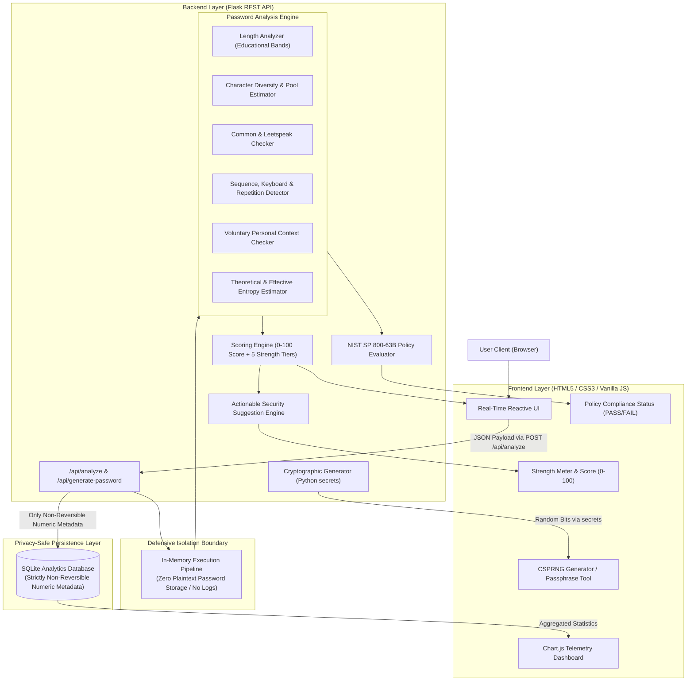
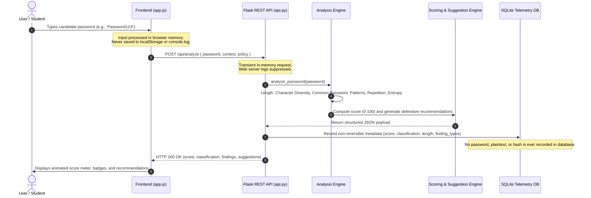

# CyberGuard Architecture & Technical Specification

## System Overview

**CyberGuard** is an industry-oriented, defensive cybersecurity application designed to evaluate password strength and calculate resilience against modern attack vectors. Unlike naive composition checkers that solely enforce character-class checklists (e.g. uppercase, lowercase, numbers, symbols), CyberGuard evaluates **Length + Unpredictability + Pattern Resistance + Common-Password Lists + Contextual Overlap**.

---

## 1. High-Level Architecture Diagram

---

## 2. Defensive Processing Pipeline

---

## 3. Core Architectural Modules

### A. Analysis Modules
1. **Length Analyzer (`length_analyzer.py`)**:
   - Maps length to 4 educational bands: `<8` (Very Short), `8–11` (Short), `12–15` (Better), `16+` (Strong).
   - Explains that length expands keyspace exponentially ($N^L$), but without uniqueness ($L$ identical characters), search space collapses.

2. **Character Analyzer (`character_analyzer.py`)**:
   - Quantifies uppercase, lowercase, numbers, symbols, and spaces.
   - Calculates `unique_character_count`, `character_type_count`, and `unique_character_ratio`.
   - Explains why `Password123!` fulfills 4-class checklists but remains easily crackable.

3. **Common Password Checker (`common_checker.py`)**:
   - Fast $O(1)$ set lookup against sanitized local dataset (`data/common_passwords.txt`).
   - Normalizes leetspeak substitutions (`p@ssw0rd` -> `password`) and root structures (`password123!` -> `password`).

4. **Pattern & Context Detector (`pattern_detector.py`)**:
   - **Sequences**: Ascending/descending numerical (`1234`, `9876`) and alphabetical (`abcd`, `dcba`).
   - **Keyboard Walks**: Horizontal (`qwerty`, `asdfgh`) and vertical (`1qaz`, `2wsx`).
   - **Repetition**: Consecutive identical chars (`aaaa`) and multi-character repeats (`ababab`, `abcabc`).
   - **Predictable Grammar**: TitleCase word + digits + symbol pattern.
   - **Voluntary Context**: Local in-memory check for first name, birth year, and organization.

5. **Entropy Estimator (`entropy_estimator.py`)**:
   - Theoretical Shannon entropy: $H = L \times \log_2(N)$ bits.
   - Effective entropy: discounts human patterns, repetitions, and common dictionary roots.

6. **Scoring Engine (`scoring_engine.py`)**:
   - Positive points: Length (+35), Diversity (+15), Uniqueness (+10), Pattern Resistance (+20), Non-Common (+10), Unpredictability (+10).
   - Explicit penalties: Common (-55), Keyboard (-18), Sequences (-15), Repetitions (-15), Context (-25), Grammar (-15).
   - Calibrated 5-tier classification:
     - 0–20: **VERY WEAK**
     - 21–40: **WEAK**
     - 41–60: **MODERATE**
     - 61–80: **STRONG**
     - 81–100: **VERY STRONG**

7. **Cryptographic Generator (`password_generator.py`)**:
   - Uses Python's `secrets` module (operating system CSPRNG: `CryptGenRandom` / `getrandom`).
   - Generates random passwords and Diceware-style passphrases from a safe curated wordlist.

---

## 4. Privacy & Zero-Knowledge Verification

| Security Domain | Implementation Standard | Verification Method |
| :--- | :--- | :--- |
| **Plaintext Storage** | Strictly Prohibited. No database field exists. | Automated schema inspection via `PRAGMA table_info` |
| **Log Leakage** | Werkzeug loggers silenced for request bodies. No `print(password)` calls. | Code review & unit test assertions |
| **API Response Leakage**| Response body returns metrics and recommendations only. Raw password never mirrored. | Automated test `test_sec_01_api_does_not_echo_password` |
| **Client Storage** | Zero storage in `localStorage` or `sessionStorage`. | Frontend code review & browser security verification |
| **DoS Boundaries** | Input capped at 256 characters to eliminate ReDoS or buffer exhaustion. | Automated test `test_sec_03_dos_length_boundary_enforced` |
| **HTTP Headers** | `Cache-Control: no-store`, `X-Content-Type-Options: nosniff`, `X-Frame-Options: DENY`. | Automated header verification test |
